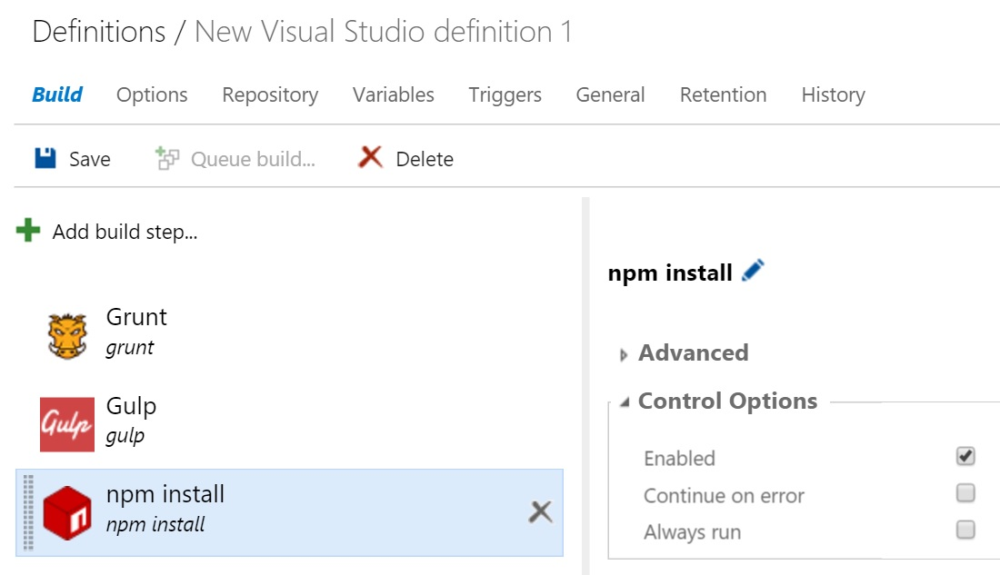

# Continuous Delivery Presentation and Demo
Demo for [Using Visual Studio Online's new build system to achieve a Continuous Delivery pipeline](http://southdakotacodecamp.net/sessions/101), given on November 7th, 2015. about Continuous Delivery and the new Microsoft Build system in 2015.    

## Build setup
 1. New build - use build > Build, Deploy, and Distributed Test template
 1. setup
 1. add Unit test step
 1. add deploy to Azure website step ([help](https://msdn.microsoft.com/Library/vs/alm/Build/azure/aspnet4))
   1. add /p:DeployOnBuild=true /p:WebPublishMethod=Package /p:PackageAsSingleFile=true /p:SkipInvalidConfigurations=true /p:PackageLocation="$(Build.StagingDirectory)" to build's MSBuild arguments, to create Azure package
   1. Azure Subscription > manage > create new Azure subscription (so VSO can do the deployment, only need the first time for a VSO project)
   1. creates the azurewebsites.net automatically, but not in your resource group :-(
     - [move to different resource group](http://blog.kloud.com.au/2015/03/24/moving-resources-between-azure-resource-groups/) - not required
 1. add **/*.zip to publish build artifacts
 
## Steps to get Selenium tests running
 - Disclaimer: I haven't gotten this working yet. [My SO question](http://stackoverflow.com/questions/33509687/setting-up-a-vm-for-selenium-tests-in-online-tfbuild)
 1. create Windows 10 enterprise - in https://portal.azure.com, this is also possible through a PowerShell script. You'll want more than 1 to run tests in parallel.
  * set the user when creating the VM.
 1. get the ip address of that VM (shutting down and starting gives you a different IP, will scripting this help manage this)
 1. Go to the test tab in the  VSO project
  * add Machine Group, 
  * the user will be the same you created in step 1.
  * Port: 5985
 1. RDP into the agent, instal Firefox and other browser that you want to run tests on.
  - Azure > VM > click the connect icon. Use the user you setup when creating the VM
  - Selenium has Firefox built in. [Other browser drivers can be downloaded](http://docs.seleniumhq.org/download/).
  - [Steps followed to get Selenium tests running](http://blogs.msdn.com/b/visualstudioalm/archive/2015/05/29/testing-in-continuous-integration-and-continuous-deployment-workflows.aspx)
     - [Enable and Use Remote Commands in Windows PowerShell](https://technet.microsoft.com/en-us/magazine/ff700227.aspx) - what should the remote computer name be? we didn't get past this.
       - "winrm s winrm/config/client '@{TrustedHosts="RemoteComputer"}' Here, RemoteComputer should be the name of the remote computer, such as: winrm s winrm/config/client '@{TrustedHosts="CorpServer56"}'"
       - build machine in https://{}.visualstudio.com/DefaultCollection/_admin/_AgentQueue or Build > edit build > General > Default Queue > Manage (http://stackoverflow.com/questions/22460876/visual-studio-online-build led me there)
        - the Answer for me is Hosted Agent so winrm s winrm/config/client '@{TrustedHosts="Hosted Agent"}'
       - 
     - file copy to the VM network path was not found error
     - emails to and from Microsoft then
       - http://blogs.msdn.com/b/powershell/archive/2009/04/03/setting-network-location-to-private.aspx
       
 ### Trials and Troubleshooting
 - to try Https (in machines), need a winrm quickconfig -transport:https which needs a cert (https://support.microsoft.com/en-us/kb/2019527)
  - associate in the security group on azure.portal? (didn't help)
 - allow unencrypted on the Agent-02? http://stackoverflow.com/questions/1469791/powershell-v2-remoting-how-do-you-enable-unencrypted-traffic
 - cd wsman:localhost\client, dir, set-item .\allowunencrypted $true
   - still " Connecting to remote server 23.96.200.254 failed with the following error message : The WinRM client cannot process the request. If the authentication scheme is different from Kerberos, or if the client computer is not joined to a domain, then HTTPS transport must be used or the destination machine must be added to the TrustedHosts configuration setting. Use winrm.cmd to configure TrustedHosts. Note that computers in the TrustedHosts list might not be authenticated. You can get more information about that by running the following command: winrm help config. For more information, see the about_Remote_Troubleshooting Help topic. For more info please refer to http://aka.ms/azurefilecopyreadme" on file copy
   lead to https://support.microsoft.com/en-us/kb/2019527
    - I need a certificate so ....
      - http://blogs.msdn.com/b/visualstudioalm/archive/2015/07/31/dev-test-in-azure-and-deploy-to-production-on-premises.aspx
      - [setup azure key vault with PS](https://azure.microsoft.com/en-us/documentation/articles/key-vault-get-started/)
      - "Tasks like Azure File Copy, PowerShell on Target Machines, Visual Studio Test Agent Deployment run on the Build Agent machine and copy files or deploy apps to Azure VMs using the WinRM HTTPS protocol. For these tasks to work properly the WinRM HTTPS port (default port is 5986) needs to be opened and configured properly on the VMs. Opening the ports and configuring them with the certificates is done using the Azure templates. "
      - didn't have makecert on the build agent?: https://dev.windows.com/en-US/downloads/windows-10-sdk, http://stackoverflow.com/questions/31772109/makecert-missing-from-windows-10-and-visual-studio-2015-install
      - UAC needs to be on for MSEdge to work
      - on build agent 
       - makecert check
       - run KeyVaultUrl.ps1 check
       - $a = Generate-KeyVaultUrl -resourceGroupName <resourceGroupName> -keyVaultName <KeyVaultName> -secretName <secretName> -location <location> -certificatePath <certPath> -password <password>
        Secrets not enabled to be retrieved from KeyVault CDDKeyVault by the Microsoft.Compute resource provider, can't
        - secreate name???
    

setup an build agent....
https://app.pluralsight.com/library/courses/tfs-build-2015-first-look/table-of-contents
http://chamindac.blogspot.com/2015/07/setup-tfs-2015-windows-build-agent.html
https://msdn.microsoft.com/Library/vs/alm/Build/agents/windows
 - create pool https://x.visualstudio.com/_admin/_AgentPool#poolId=3&_a=agents
  - create VM with Visual Studio already installed.
  install Azure powershell.
  - download agent from the Agent Pool page.
  - run on VM 
  - Set-ExecutionPolicy RemoteSigned
  - in agent files directory get-childItem -recurse * | Unblock-File
  - run ps script
  - needs VS for a demand (installed community version)
  - add capabilities in the https://x.visualstudio.com/DefaultCollection/_admin/_AgentQueue (VSTest, Visual Studio, AzurePs)
  - Attempting to perform the NormalizeRelativePath operation on the 'FileSystem' provider failed for path 'C:\Users\cdd\Desktop\agent\tasks\VSBuild\1.0.16'. Access is denied
    - http://stackoverflow.com/questions/32503653/tfs-vnext-build-agent-installation?? - after a reboot, it didn't fix the error
    
## Main Points
 1. Microsoft has greatly improved their build system.
 1. You can get started quickly, but there is a lot of depth to dig into.
 1. Visual Studio Online gets the latest code, then it is rolled out to on premise TFS installs.
 1. You can build non-Microsoft technologies with it and run NodeJs NPM, Bower and Grunt/Gulp tasks in it.
   - 
    - [Image credit](http://jeremylikness.github.io/Top10EnterpriseJS/#33)
    
    
 
 
## Links

### Continuous Delivery
 - [Highly recommended book by Jez Humble and David Farley](http://www.continuousdelivery.com) 
 - [Links to videos and talks](http://continuousdelivery.com/talks/)
 - http://blogs.msdn.com/b/uk_faculty_connection/archive/2015/09/07/continuous-integration-and-testing-using-visual-studio-online.aspx
 - http://blogs.msdn.com/b/visualstudioalm/archive/2015/05/29/testing-in-continuous-integration-and-continuous-deployment-workflows.aspx
 - [DZone 2015 Survey](https://dzone.com/guides/code-quality-and-software-agility-2015-edition)
 - [Feature Flags are essential](http://martinfowler.com/bliki/FeatureToggle.html)
 - [Spotify insights into their development process, I highly recommend it](https://www.youtube.com/watch?v=Mpsn3WaI_4k)
 
### Visual Studio Online/TFS Build
 - [Announcement of the features - new build is around 38 minutes - Nov 2014](https://channel9.msdn.com/Events/Visual-Studio/Connect-event-2014/015)
 - [Forrester Reasearch on DevOps](http://event.lvl3.on24.com/event/10/71/20/6/rt/1/documents/resourceList1446853695802/microsoft_devops_tlp_final.pdf)
 - http://www.pluralsight.com/courses/tfs-build-2015-first-look
 - https://msdn.microsoft.com/Library/vs/alm/Build/feature-overview
 - [TFS 2015 release notes](https://www.visualstudio.com/news/tfs2015-update1-vs)
  - [Support for Azure Resource Groups in Update 1](https://www.visualstudio.com/news/tfs2015-update1-vs#azurergp)
 - http://geekswithblogs.net/jakob/archive/2015/01/15/tfs-build-vnext-ndash-a-preview.aspx
 - https://msdn.microsoft.com/en-us/Library/vs/alm/Build/agents/windows
 - Setting Up Test Controllers and Test Agents to Manage Tests with Visual Studio -> https://msdn.microsoft.com/en-us/library/vstudio/hh546459(v=vs.140).aspx
 - Azure preview of DevTest labs
  - https://azure.microsoft.com/en-us/campaigns/devtest-lab/
  - https://azure.microsoft.com/en-us/documentation/scenarios/devtest/
  - https://azure.microsoft.com/en-us/campaigns/dev-test-starts-with-it-webinar-series/?wt.mc_id=WW_ABG_CLD_OO_SCL_TW&Ocid=C+E%20Social%20FY16_Social_TW_Azure_20151028_265221381
 -  [host on GitHub build on VSO](http://ivision.com/blog/using-visual-studio-online-to-build-a-github-hosted-javascript-project-with-npm-bower-and-grunt-for-free/)
  - http://geekswithblogs.net/jakob/archive/2015/06/12/building-github-repositories-in-tfs-build-vnext.aspx
  - https://www.visualstudio.com/en-us/get-started/build/hosted-build-controller-vs
 - [Performance test in the build and VS enterprise](https://azure.microsoft.com/en-us/documentation/videos/performance-testing-web-applications-from-visual-studio-enterprise-with-manas-maheshwari/)
  - http://geekswithblogs.net/jakob/archive/2015/11/02/performance-tests-for-azure-web-apps.aspx
 
 - http://blogs.msdn.com/b/mvpawardprogram/archive/2015/10/27/continuous-integration-with-ionic-framework-using-visual-studio-online-from-check-in-to-device.aspx
 - http://geekswithblogs.net/jakob/archive/2015/10/25/10-features-in-team-foundation-server-that-you-maybe-didnrsquot.aspx
 - [Dev Test Webinar series](https://azure.microsoft.com/en-us/campaigns/dev-test-starts-with-it-webinar-series/)
 - [Pluralsight video](https://app.pluralsight.com/library/courses/tfs-build-2015-first-look/table-of-contents)
 
### Dig Deeper
 - [Generate custom build numbers](http://geekswithblogs.net/jakob/archive/2015/10/15/generate-custom-build-numbers-in-tfs-build-vnext.aspx)
 - [Technical Debt Management: Announcing SonarQube integration with MSBuild and Team Build](http://blogs.msdn.com/b/visualstudioalm/archive/2015/04/28/technical-debt-management-announcing-sonarqube-integration-with-msbuild-and-team-build.aspx)
   - [in VSO build as of Sept 1, 2015](http://www.sonarqube.org/msbuild-sonarqube-runner-now-available-on-visual-studio-online/)
 - [Test Pyramid for Automation Testing](http://martinfowler.com/bliki/TestPyramid.html)
   - [not the ice cream cone](http://watirmelon.com/2012/01/31/introducing-the-software-testing-ice-cream-cone/)
 - [Database Change Management with CD](http://www.geekswithblogs.net/Aligned/archive/2015/01/21/databases-in-continuous-delivery.aspx)
 - [Early look at containers in Windows Server, Hyper-V and Azure – with Mark Russinovich](https://youtu.be/YoA_MMlGPRc)
 - 
 
#### Testing (there are a lot more opinions and subject matter on this)
  - [My articles](http://geekswithblogs.net/Aligned/category/13960.aspx)
  - [Recommended Art of Unit Testing book and videos](http://artofunittesting.com/)
  - [Recent DotNetRocks podcast - Mature Test-Driven Development with Justin Searls](http://dotnetrocks.com/?show=1207)
 
#### Specifications By Example
 - [Suggested Specifications By Example book](http://specificationbyexample.com/)
 - [Spec-ing-Out-End-To-End-Scenarios](http://cqrsjourney.github.io/blog/2012/05/14/Specing-Out-End-To-End-Scenarios/)
 - [Specflow BDD examples](http://stackoverflow.com/questions/3443302/specflow-bdd-examples)
  
#### Other build technology offerings:
  - http://www.pluralsight.com/courses/continuous-integration-psake-teamcity-getting-started
